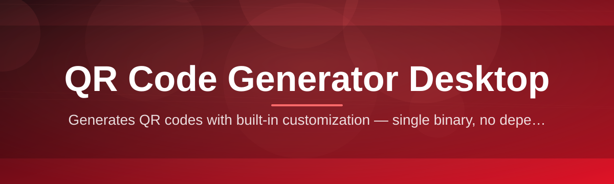
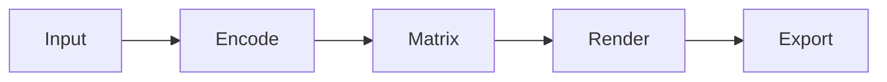

# qr-code-desktop-tool 🔳⚡

  

*One input, one click, one flawless QR code — no browser tabs required.*

  

## 📡 Overview

Every QR code generator on the web asks something in return — your data, an account, or a slow round-trip through a server you'll never audit. **qr-code-desktop-tool** removes that trade entirely. It's a native Windows application that turns text, URLs, contact cards, and Wi-Fi credentials into crisp, scannable QR codes — fully offline, fully local, fully yours.

The tool exists because QR generation shouldn't be a web service. Marketing teams batching campaign links, developers embedding codes into product packaging, IT admins provisioning Wi-Fi onboarding cards, event organizers printing check-in badges — all of them need speed, repeatability, and zero dependency on an internet connection or a third-party server logging their inputs. This project was built for exactly that gap.

Under the hood it's lightweight by design: a compact desktop binary with no background services, no telemetry pings, and no installer bloat. Open it, type, export. That's the entire workflow — engineered for people who generate dozens of codes a day and refuse to lose time to a spinning loader.

---

## 🧩 What It Actually Does

  

- **Instant rendering** — QR codes generate live as you type, no "Generate" button lag.

- **Multi-format input** — plain text, URLs, vCards, Wi-Fi credentials, email templates, and SMS payloads all map to correct QR standards automatically.

- **Batch export** — feed a list, walk away, come back to a folder full of finished PNG/SVG files.

- **Color and logo embedding** — brand your codes with custom foreground/background colors and center logos without breaking scan reliability.

- **Error-correction control** — pick L/M/Q/H levels depending on whether the code will be printed small or plastered on a billboard.

- **Resolution scaling** — export from tiny 128px thumbnails to print-ready 4000px canvases.

- **History and reuse** — every generated code is cached locally so re-exporting yesterday's campaign QR takes one click.

- **Fully offline core** — the generation engine runs on-device; nothing leaves your machine.

---

## 🚀 How To Get Started

1. Visit the landing page via the download button above.

2. Grab the latest standalone build — no bundled extras, no toolbars.

3. Launch the executable directly; Windows may show a SmartScreen prompt on first run since the binary is freshly signed each release.

4. Type your content, watch the preview render, export in your preferred format.

> [!TIP]
> Pin the app to your taskbar if you generate QR codes daily — cold start is under a second.

---

## 🖥️ System Requirements

| Requirement | Minimum |
|---|---|
| OS | Windows 10 (64-bit) or Windows 11 |
| RAM | 200 MB free |
| Disk | 80 MB |
| Dependencies | None — fully standalone |
| Internet | Not required after download |

> [!NOTE]
> No .NET runtime installation, no Visual C++ redistributables, no background installer processes. The executable is self-contained.

---

## ⚙️ How It Works

The generation pipeline is intentionally short — fewer steps mean fewer failure points.

1. **Input capture** — your text/URL/vCard data is validated against the target QR payload spec.

2. **Encoding** — the encoder selects the optimal QR version and error-correction level automatically.

3. **Matrix build** — the module grid is computed and quiet-zone padding applied.

4. **Render** — the matrix is painted to canvas with your chosen colors, logo, and scale.

5. **Export** — the final image is written to disk in your selected format.

---

## 🛟 Troubleshooting

**Q: My generated QR code won't scan on some phones.**
A: Increase the error-correction level to Q or H, and ensure sufficient white quiet-zone margin around the code — logo overlays at low error-correction can obscure critical modules.

**Q: The app shows a Windows SmartScreen warning on launch.**
A: This is expected for freshly released standalone binaries. Click "More info" → "Run anyway." The binary is unsigned by a paid certificate authority but unmodified from the source release.

**Q: Exported SVGs look pixelated when scaled in design software.**
A: You're likely exporting PNG and renaming the extension. Confirm SVG is selected explicitly in the export dropdown — it's a true vector output.

**Q: Wi-Fi QR codes generate but devices reject the connection.**
A: Double-check the security protocol field (WPA/WEP/none) matches your router exactly — a mismatch produces a technically valid but functionally useless code.

**Q: Batch export stops partway through a large list.**
A: Check for empty lines or malformed entries in your input list — the batch engine skips and logs invalid rows rather than crashing, so check the log panel.

> [!WARNING]
> Never encode sensitive credentials (banking PINs, private keys) into a QR code intended for public or printed distribution — QR codes are trivially readable by anyone with a camera.

---

## 🎨 UI / UX Details

<strong>Keyboard Shortcuts</strong>

| Shortcut | Action |
|---|---|
| `Ctrl + N` | New QR project |
| `Ctrl + S` | Export current code |
| `Ctrl + Shift + S` | Batch export |
| `Ctrl + L` | Toggle light/dark theme |
| `Ctrl + Z` | Undo last style change |
| `F2` | Rename current preset |

<strong>Themes & Personalization</strong>

- Light, Dark, and System-synced themes

- Adjustable canvas grid overlay for precision alignment

- Custom accent colors independent of QR foreground/background

> [!IMPORTANT]
> Settings are stored in a local config file only — nothing syncs to the cloud, and nothing is transmitted on save.

---

## 🤝 Contributing & Community

Bug reports, feature requests, and pull requests are welcome. Before opening an issue:

- Search existing issues to avoid duplicates.

- Include your Windows build number and steps to reproduce.

- For feature requests, describe the real-world QR use case driving it.

> [!TIP]
> Discussions tab is the right place for workflow questions; Issues tab is reserved for bugs and concrete feature proposals.

---

## 📄 License

Released under the [MIT License](LICENSE), 2026. Use it, fork it, ship it inside your own tools — attribution appreciated, not required.

---

## ⚠️ Disclaimer

This software is provided "as is," without warranty of any kind. The maintainers are not responsible for content encoded into QR codes generated by this tool, nor for outcomes resulting from scanning third-party codes. Always verify QR destinations before distributing them publicly.

